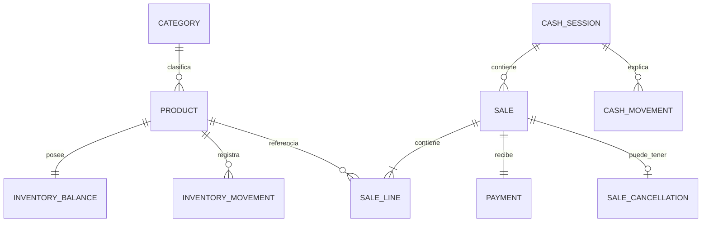

# 06 — Modelo de dominio inicial

**Proyecto:** Sistema POS e inventario para minimarket familiar

**Estado:** Aprobado - Entrega 1

**Versión:** 0.1

**Fecha:** 2026-07-31

Este modelo describe conceptos, responsabilidades e invariantes. Todavía no define tablas, endpoints ni clases definitivas.

## 1. Límites funcionales iniciales

| Módulo | Responsabilidad |
|---|---|
| Identity | Usuarios, credenciales, estado y roles. |
| Catalog | Productos, categorías, códigos, precios vigentes y búsqueda. |
| Inventory | Saldo y movimientos de existencias. |
| Cash | Sesiones y movimientos de efectivo. |
| Sales | Carrito validado, confirmación, líneas, pagos, historial y anulaciones. |
| Scanner | Vinculación temporal y entrega segura de eventos de código. |
| Reporting | Consultas derivadas sin modificar los módulos operacionales. |

Estos límites guían un monolito modular. No implican servicios desplegados por separado.

## 2. Entidades y agregados candidatos

### User

Representa a una persona autorizada.

**Datos principales:** identificador, nombre de usuario, contraseña codificada, rol, estado, fechas de creación/modificación.

**Invariantes:** el nombre de usuario es único; un usuario inactivo no autentica; la contraseña nunca se almacena ni registra en texto claro.

### Category

Organiza productos.

**Datos principales:** identificador, nombre, estado.

**Invariantes:** no se elimina físicamente si está referenciada históricamente.

### Product

Contiene la información comercial vigente.

**Datos principales:** identificador, código opcional, nombre, categoría, precio de compra, precio de venta, stock mínimo, estado y fechas.

**Invariantes:** código único cuando existe; precios no negativos; un producto inactivo no se vende; editarlo no cambia el stock.

La búsqueda por código pertenece al catálogo y usa coincidencia exacta. La búsqueda por nombre es parcial e insensible a mayúsculas y acentos. El mecanismo técnico de normalización se decidirá en arquitectura.

### InventoryBalance

Mantiene el saldo operacional de un producto.

**Datos principales:** producto, cantidad disponible y versión de concurrencia.

**Invariantes:** una fila por producto; cantidad entera no negativa; solo cambia junto con un `InventoryMovement`.

### InventoryMovement

Explica cada cambio de stock.

**Datos principales:** producto, tipo, magnitud, dirección, saldo anterior, saldo resultante, fecha, usuario, motivo, referencia de venta o anulación.

**Tipos iniciales:** entrada, salida por venta, ajuste positivo, ajuste negativo, dañado, vencido y reversión por anulación.

**Invariantes:** es inmutable; los saldos deben ser matemáticamente consistentes; un ajuste manual tiene motivo.

### CashSession

Representa una jornada de caja.

**Datos principales:** identificador, usuario de apertura, fecha de apertura, monto inicial, estado, usuario y fecha de cierre, efectivo contado, efectivo esperado al cierre y diferencia.

**Estados:** `OPEN`, `CLOSED`.

**Invariantes:** una sola abierta; una cerrada no se reabre; el cierre conserva los valores calculados como fotografía histórica.

### CashMovement

Explica variaciones del efectivo físico esperado.

**Datos principales:** sesión, tipo, monto, fecha, usuario, motivo y referencia de venta o anulación.

**Tipos iniciales:** venta en efectivo, ingreso manual, retiro/gasto y devolución en efectivo.

**Invariantes:** monto positivo; dirección determinada por el tipo; pertenece a una sesión abierta al crearse; es inmutable.

El monto inicial pertenece a `CashSession` y no necesita duplicarse como movimiento.

### Sale

Raíz del registro histórico de una venta.

**Datos principales:** identificador, folio interno, sesión de caja, usuario, fecha, estado, total, líneas, pago y clave de idempotencia.

**Estados:** `CONFIRMED`, `VOIDED`.

**Invariantes:** al menos una línea; total exacto; una sola sesión y pago; no se edita después de confirmar; una clave de idempotencia no crea más de una venta.

### SaleLine

Fotografía de un producto vendido.

**Datos principales:** producto referenciado, nombre capturado, código capturado, cantidad, precio unitario aplicado, costo unitario estimado, subtotal.

**Invariantes:** cantidad entera positiva; subtotal igual a cantidad por precio; sus valores históricos no se recalculan usando el producto actual.

### Payment

Registra cómo se pagó una venta.

**Datos principales:** venta, método, monto, efectivo recibido y vuelto cuando corresponda.

**Métodos:** `CASH`, `CARD`, `TRANSFER`.

**Invariantes:** un pago por venta; monto igual al total; recibido y vuelto solo aplican a efectivo.

### SaleCancellation

Registra la operación que anula una venta.

**Datos principales:** venta, administrador, fecha, motivo, monto devuelto, método de devolución y sesión de caja de devolución cuando corresponda.

**Invariantes:** una como máximo por venta; monto igual al total de la venta; produce reposición de inventario; si el método es efectivo exige una caja abierta y produce allí un `CashMovement` de devolución. No altera la sesión histórica de la venta si ya está cerrada.

### ScannerPairing

Autoriza temporalmente un teléfono para una sesión POS concreta.

**Datos principales:** identificador seguro, sesión POS, creador, creación, expiración, estado y consumo.

**Invariantes:** temporal, revocable, un solo uso y no reutilizable en otra sesión.

### ScanEvent

Representa la recepción de un código desde el lector.

**Datos principales:** identificador de evento, vinculación, código y fecha.

**Invariantes:** identificador único en la vinculación; no contiene precio, nombre ni stock; no confirma ventas.

## 3. Objetos de valor candidatos

### Money

Monto exacto en CLP. Centraliza validación, suma, resta, multiplicación por cantidad y comparación. Para el MVP acepta escala cero.

### Quantity

Cantidad entera. Según el caso puede exigir valor positivo o permitir cero como saldo.

### Barcode

Texto normalizado solo en espacios externos. Conserva ceros iniciales y no realiza conversiones numéricas.

### InternalFolio

Identificador legible único de una venta, separado de su identificador técnico y sin significado tributario.

### IdempotencyKey

Identificador proporcionado para una intención de confirmación. Su unicidad protege contra doble clic y reintentos.

## 4. Relaciones principales

El diagrama no representa todavía tablas ni claves foráneas definitivas.

## 5. Consistencia y transacciones

### Confirmación de venta

Una única transacción debe:

1. Validar usuario y caja abierta.
2. Validar o reservar la clave de idempotencia.
3. Resolver nuevamente todos los productos.
4. Validar estado y stock bajo control de concurrencia.
5. Calcular precios, subtotales, total y vuelto.
6. Crear `Sale`, `SaleLine` y `Payment`.
7. Actualizar cada `InventoryBalance` y crear sus movimientos.
8. Crear `CashMovement` si el pago es en efectivo.
9. Confirmar todos los cambios juntos.

La estrategia concreta —bloqueo pesimista, versión optimista o actualización condicional— se resolverá en la Entrega 2 y deberá probarse con PostgreSQL real.

### Anulación

Una única transacción debe:

1. Validar administrador y venta confirmada.
2. Crear `SaleCancellation`.
3. Cambiar el estado de la venta.
4. Reponer cada cantidad mediante movimientos de reversión.
5. Si la devolución es en efectivo, validar una caja abierta y registrar en ella la salida correspondiente.

La anulación puede ocurrir después del cierre original. Los reportes de la venta mostrarán su estado anulado, pero los valores históricos del cierre original no se reescriben; la salida física aparece en la sesión que entrega el dinero.

## 6. Autoridad y datos históricos

- `Product` representa datos vigentes.
- `SaleLine` representa los datos aplicados al vender.
- `InventoryBalance` responde cuánto stock existe ahora.
- `InventoryMovement` responde por qué existe ese saldo.
- `CashSession` y `CashMovement` responden cuánto efectivo debería existir y por qué.
- `SaleCancellation` conserva quién corrigió una venta y cómo se registró la devolución.

## 7. Preguntas no bloqueantes para entregas posteriores

- ¿Qué reportes puede consultar el vendedor además de su sesión activa?
- ¿Cuánto tiempo se conservarán sesiones y eventos técnicos del lector?
- ¿Qué RPO y RTO se aceptarán para respaldo y restauración?

Estas preguntas no cambian el núcleo aprobado, pero deberán resolverse antes de implementar los módulos correspondientes.

OQ-04 se resolvió el 2026-08-04: el código opcional admite de 1 a 64 letras, números o `- . _ /`, sin espacios internos; solo se recortan extremos y se conservan mayúsculas y ceros iniciales.

OQ-03 se resolvió el 2026-08-04: ingresos `REFUERZO_DE_EFECTIVO` y `OTRO_INGRESO`; retiros `PAGO_A_PROVEEDOR`, `GASTO_OPERATIVO`, `RETIRO_PREVENTIVO` y `OTRO_RETIRO`. El motivo es obligatorio en todas.
