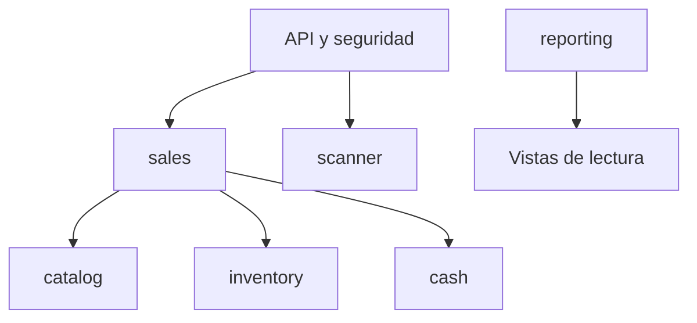

# 07 — Mapa de módulos

**Proyecto:** Sistema POS e inventario para minimarket familiar

**Estado:** Aprobado - Entrega 2

**Versión:** 0.1

**Fecha:** 2026-07-31

## 1. Objetivo

Organizar el backend como un monolito modular: una sola aplicación desplegable y una sola base de datos, con límites internos explícitos. Los módulos colaboran mediante interfaces de aplicación y datos simples; no comparten controladores, repositorios ni entidades persistentes.

## 2. Módulos

| Módulo | Responsabilidad | Datos que posee | No debe hacer |
|---|---|---|---|
| `identity` | Usuarios, credenciales, sesiones y roles | Usuario, rol y sesión autenticada | Decidir reglas de ventas o caja |
| `catalog` | Categorías, productos, precios vigentes y búsqueda | Categoría y producto | Cambiar stock directamente |
| `inventory` | Saldo y movimientos de existencias | Saldo y movimiento de inventario | Conocer pagos o totales de caja |
| `cash` | Apertura, movimientos, efectivo esperado y cierre | Sesión y movimiento de caja | Editar o anular ventas |
| `sales` | Confirmación, líneas, pago, historial y anulación | Venta, línea, pago y anulación | Confiar en precios o totales del cliente |
| `scanner` | Vinculación temporal y eventos de códigos | Solicitud de vinculación, sesión lectora y evento | Resolver precios, stock o confirmar ventas |
| `reporting` | Consultas y agregaciones de lectura | No posee registros operacionales | Modificar otros módulos |

## 3. Estructura interna

```text
com.minimarket.pos/
├── identity/
├── catalog/
├── inventory/
├── cash/
├── sales/
├── scanner/
├── reporting/
└── shared/
```

Cada módulo funcional podrá contener:

```text
module/
├── domain/          # Entidades, objetos de valor y reglas propias
├── application/     # Casos de uso, puertos y coordinación
├── infrastructure/  # JPA, adaptadores y configuración técnica
└── api/             # Controladores y DTO HTTP
```

Esta separación es pragmática, no dogmática:

- El dominio no conoce controladores, JSON ni DTO HTTP.
- Las API nunca exponen entidades JPA directamente.
- Los repositorios Spring Data viven en infraestructura.
- Las interfaces requeridas por los casos de uso viven en aplicación.
- Se permite usar anotaciones JPA en entidades de dominio cuando eviten una duplicación sin valor, siempre que no afecten sus pruebas unitarias ni expongan persistencia fuera del módulo.
- No se crearán interfaces o mapeadores si solo añaden ceremonia.

## 4. Dependencias permitidas



Reglas de dependencia:

1. `sales` puede consultar catálogo y solicitar operaciones a inventario y caja.
2. `inventory` puede consultar la existencia de un producto mediante una interfaz pública de catálogo, pero nunca importa sus repositorios.
3. `cash` no depende de `sales`; recibe comandos con referencias de venta.
4. `scanner` transporta un código al POS vinculado. El POS llama luego a la búsqueda normal de catálogo.
5. `reporting` puede consultar tablas o vistas de varios módulos mediante adaptadores de solo lectura.
6. `identity` aporta el actor autenticado mediante el contexto de seguridad; los demás módulos guardan su identificador, no la entidad de usuario.
7. `shared` solo contiene conceptos realmente comunes: `Money`, identificadores, reloj, actor de auditoría y errores base.

## 5. Interfaces públicas candidatas

| Proveedor | Interfaz conceptual | Consumidor |
|---|---|---|
| `catalog` | Buscar candidatos; obtener fotografía comercial vigente | `sales`, `inventory`, API administrativa |
| `inventory` | Consultar saldo; consumir; reponer; ajustar | `sales`, API administrativa |
| `cash` | Obtener caja abierta; registrar movimiento; abrir/cerrar | `sales`, API de caja |
| `sales` | Confirmar; consultar; anular | API y `reporting` |
| `scanner` | Crear/consumir vinculación; publicar/recibir evento | API POS y móvil |
| `identity` | Actor actual y comprobación de permisos | Capa de aplicación |

Los contratos utilizarán identificadores y DTO internos inmutables. Ningún módulo podrá recibir y modificar directamente el agregado de otro.

## 6. Orquestación de venta

`sales` será el coordinador de la confirmación porque conoce la intención completa de negocio. Dentro de una transacción:

1. Valida idempotencia.
2. Obtiene y bloquea la caja abierta.
3. Resuelve fotografías vigentes de productos.
4. Solicita a inventario bloquear y descontar saldos.
5. Crea venta, líneas y pago.
6. Solicita a caja registrar el movimiento si corresponde.
7. Confirma la operación completa.

Esta coordinación no convierte a `sales` en dueño de los datos de inventario o caja. Cada módulo mantiene sus invariantes y ofrece una operación estrecha.

## 7. Orquestación de anulación

`sales` coordina:

1. Validación de venta confirmada y permiso administrativo.
2. Creación del registro de anulación.
3. Reposición mediante `inventory`.
4. Salida en la caja abierta mediante `cash` cuando la devolución es en efectivo.
5. Cambio del estado de venta.

Una anulación nunca actualiza los totales históricos de una caja cerrada.

## 8. Búsqueda de productos

`catalog` ofrecerá operaciones de búsqueda de candidatos y consulta comercial. Para evitar una dependencia circular entre catálogo e inventario, la búsqueda visible en el POS será compuesta por una consulta de aplicación en `sales`:

- `catalog` busca coincidencias y aplica estado activo.
- `inventory` entrega los saldos correspondientes.
- `sales` combina ambos resultados en el DTO del POS.
- La API administrativa usa directamente la búsqueda paginada de catálogo y puede incluir inactivos.

Para el campo unificado del POS:

1. Se intenta primero una coincidencia exacta de código.
2. Si no existe, se busca por nombre normalizado parcial.
3. Una coincidencia exacta de código se marca como tal para que la interfaz pueda agregarla directamente.
4. Los resultados por nombre requieren selección del usuario.

El saldo procede de `inventory`; catálogo no mantiene una segunda copia ni depende de inventario.

## 9. Frontend por funcionalidades

Se mantendrá una sola aplicación React:

```text
src/
├── app/             # Router, providers y composición
├── features/
│   ├── auth/
│   ├── catalog/
│   ├── inventory/
│   ├── cash/
│   ├── sales/
│   ├── scanner/
│   └── reporting/
├── shared/
│   ├── api/
│   ├── components/
│   ├── hooks/
│   ├── types/
│   └── utils/
└── main.tsx
```

Reglas:

- El carrito se administra localmente mediante un reducer o estado equivalente.
- El total mostrado se trata como preliminar hasta que el backend confirme.
- Los permisos visuales mejoran la experiencia, pero no sustituyen la autorización.
- La interfaz móvil del lector será una ruta mínima dentro del mismo proyecto.
- No se incorporará Redux inicialmente.

## 10. Verificación de límites

Los límites se protegerán mediante:

- Convenciones de paquetes.
- Visibilidad `package-private` cuando sea posible.
- Pruebas ArchUnit para dependencias prohibidas.
- Revisión de imports en cada pull request.
- Pruebas unitarias del dominio sin levantar Spring.

Spring Modulith no se incorpora inicialmente. Se reevaluará únicamente si sus verificaciones aportan más valor que ArchUnit y las convenciones existentes.
