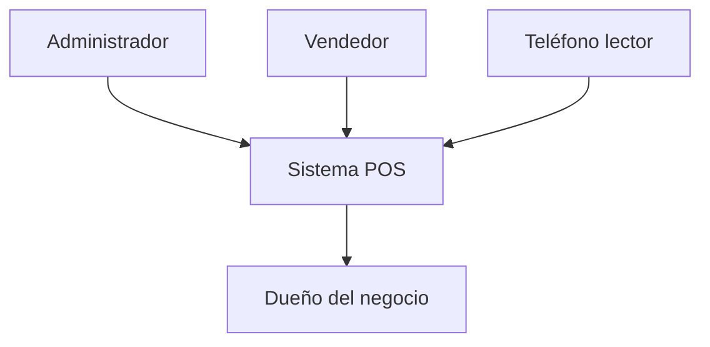
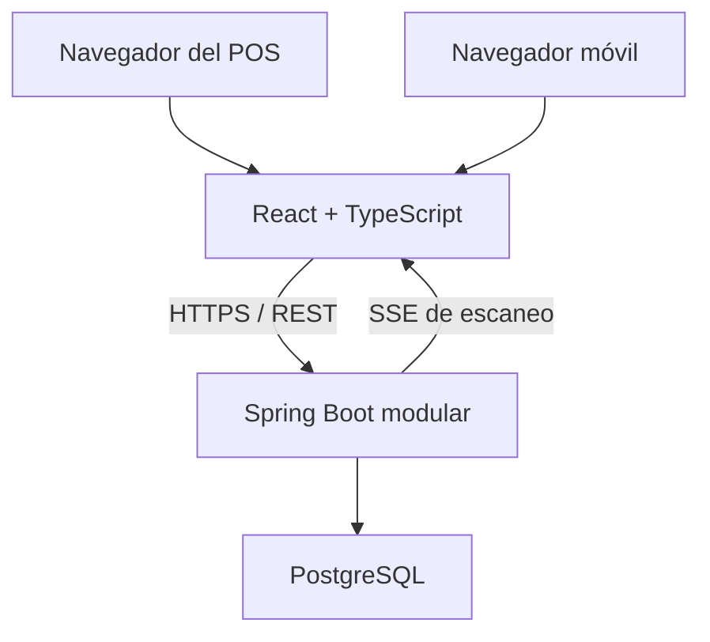
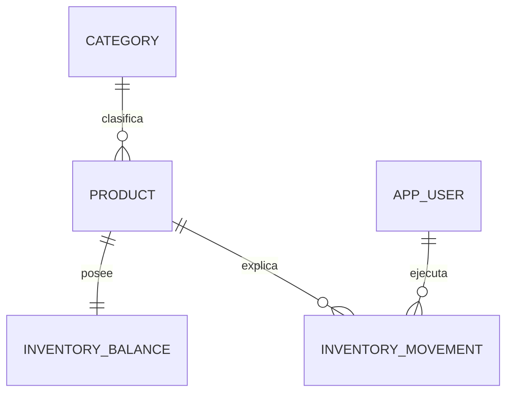
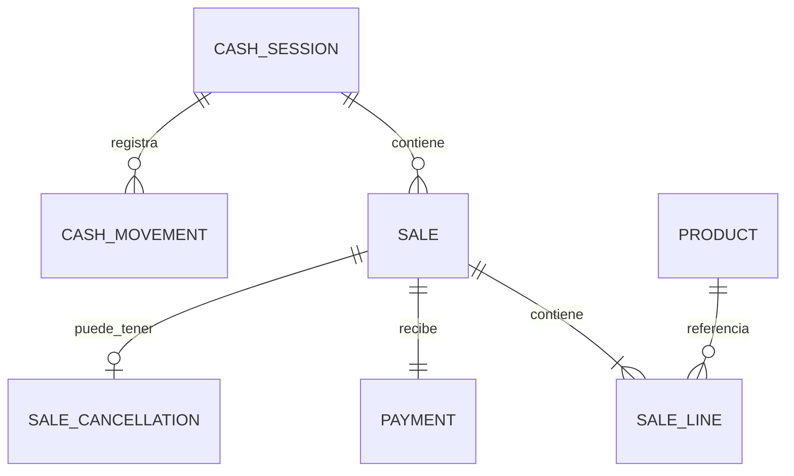

# 08 — Arquitectura y modelo de datos preliminar

**Proyecto:** Sistema POS e inventario para minimarket familiar

**Estado:** Aprobado - Entrega 2

**Versión:** 0.1

**Fecha:** 2026-07-31

## 1. Decisión arquitectónica

El sistema será un **monolito modular web** con un backend, un frontend y una base PostgreSQL. La aplicación prioriza consistencia transaccional, trazabilidad y facilidad de operación por sobre escalabilidad distribuida.

## 2. Contexto

No existen integraciones con bancos, adquirentes, proveedores ni SII. Tarjeta y transferencia se registran como métodos declarados, no como pagos verificados externamente.

## 3. Contenedores

### Frontend

- Aplicación estática React, Vite y TypeScript.
- Rutas para venta, administración, reportes y lector móvil.
- No contiene reglas financieras definitivas.
- Mantiene el carrito previo a la confirmación.

### Backend

- Java 21 LTS.
- Spring Boot en una versión estable y soportada al iniciar la implementación.
- Spring Security, Spring Data JPA, Spring Validation y Spring Session JDBC.
- API REST versionada bajo `/api/v1`.
- SSE para eventos unidireccionales del lector hacia el POS.
- Maven Wrapper para compilaciones reproducibles.

### Base de datos

- PostgreSQL.
- Flyway como único mecanismo de cambio de esquema.
- `ddl-auto=validate`; nunca creación o actualización automática en staging o producción.
- Restricciones, índices y bloqueos de filas como parte de la defensa de invariantes.

Las versiones exactas de Spring Boot, PostgreSQL, Node, React y Vite se fijarán en la historia de base técnica, se guardarán en archivos de bloqueo y se actualizarán mediante pull requests controlados.

## 4. Despliegue

### Política de costo cero durante la etapa actual

- La infraestructura debe utilizar ejecución local o planes gratuitos.
- Ningún servicio puede generar cobros, activar escalado pagado o superar automáticamente una cuota gratuita.
- Toda excepción requiere una propuesta con costo, beneficio, alternativa gratuita, riesgo y aprobación explícita antes de crear el recurso.
- La ausencia de una alternativa gratuita adecuada no autoriza a reducir controles de seguridad o integridad; en ese caso se mantiene el ambiente local o de staging.
- La evaluación de infraestructura pagada para operación real se realizará como decisión futura separada.

### Topología recomendada

- Frontend servido estáticamente.
- Backend como una única instancia inicialmente.
- PostgreSQL administrado o instancia protegida con backups.
- Un único dominio público con enrutamiento `/api` al backend cuando la plataforma lo permita.

El mismo origen simplifica cookies, CSRF y CORS. Si frontend y backend quedan en orígenes diferentes, se utilizará una lista explícita de orígenes, credenciales habilitadas únicamente para ellos y cookies `Secure` con configuración `SameSite` compatible.

### Ambientes

| Ambiente | Datos | Objetivo |
|---|---|---|
| Local | Sintéticos | Desarrollo con Docker Compose |
| CI | Efímeros | Pruebas y migraciones con Testcontainers |
| Staging | Sintéticos representativos | QA, seguridad y regresión |
| Producción | Reales del negocio | Operación controlada |

Ningún ambiente comparte base, credenciales o secretos con producción.

Durante la etapa de costo cero, un despliegue con plan gratuito solo podrá clasificarse como producción si cumple los controles mínimos de seguridad, persistencia, backup y restauración. De lo contrario será un ambiente de demostración o staging, aunque sea accesible públicamente.

## 5. API

### Convenciones

- JSON mediante HTTPS.
- Recursos y comandos bajo `/api/v1`.
- DTO de entrada y salida independientes de entidades persistentes.
- Paginación para listados.
- Fechas en ISO 8601 con zona o desplazamiento inequívoco.
- Montos como números enteros de pesos en el contrato; se procesan con `BigDecimal` de escala cero.
- Códigos de barras siempre como cadenas.

### Errores

Se utilizará `application/problem+json`, compatible con Problem Details, incluyendo:

- `type` o código estable del problema.
- `title`.
- Estado HTTP.
- Detalle seguro para el usuario.
- Identificador de correlación.
- Errores de campos cuando corresponda.

Nunca se enviarán trazas, SQL, secretos ni detalles internos al cliente.

### Contrato

Spring generará el documento OpenAPI desde controladores y DTO. CI conservará el contrato como artefacto y detectará cambios incompatibles. No se generará automáticamente lógica de dominio desde OpenAPI.

## 6. Autenticación y sesión

Se elige autenticación de sesión con cookie opaca:

- Sesiones persistidas mediante Spring Session JDBC en PostgreSQL.
- Cookie `HttpOnly`, `Secure` en ambientes públicos y `SameSite` apropiado.
- Rotación del identificador al autenticar.
- Protección CSRF para operaciones que modifican estado.
- Cierre de sesión invalida el servidor y expira la cookie.
- Contraseñas codificadas con Argon2id usando parámetros medidos para el entorno.
- Rate limiting local para login, consumo de vinculaciones y eventos del lector mientras exista una sola instancia backend.

No se utilizarán JWT almacenados en `localStorage`. Para pocos usuarios y un backend, una sesión revocable resulta más simple y reduce la exposición del token a JavaScript.

## 7. Transacciones, concurrencia e idempotencia

### Confirmación de venta

Una transacción PostgreSQL con aislamiento `READ COMMITTED`:

1. Busca la clave de idempotencia.
2. Bloquea la sesión de caja abierta.
3. Ordena los productos por identificador.
4. Bloquea sus filas `inventory_balance` mediante `SELECT ... FOR UPDATE`.
5. Vuelve a validar productos activos, cantidades y saldo.
6. Calcula valores en backend.
7. Inserta venta, líneas y pago.
8. Actualiza saldos e inserta movimientos.
9. Inserta el movimiento de caja si corresponde.
10. Confirma.

Bloquear productos en orden estable reduce el riesgo de deadlock. Si no existe stock, la transacción falla antes de producir efectos.

### Idempotencia

- El cliente genera una clave UUID por intención de confirmación.
- `sale.idempotency_key` tiene restricción única.
- Se almacena un hash canónico de la solicitud.
- Repetir clave y mismo hash devuelve la venta ya creada.
- Repetir clave con un contenido diferente responde conflicto.
- Si la transacción original falla, no queda una clave consumida y se permite reintentar.
- Si dos solicitudes iguales llegan simultáneamente, la restricción única serializa el conflicto; después del rollback técnico, la segunda consulta y devuelve la venta confirmada por la primera.

Si en el futuro se ejecuta más de una instancia backend, se revisarán el rate limiting y la distribución de canales SSE antes de escalar. No se incorpora Redis anticipadamente.

### Apertura de caja

Una restricción única parcial de PostgreSQL permite como máximo una fila con estado `OPEN`. La aplicación valida primero para entregar un mensaje claro; la base constituye la protección final frente a concurrencia.

### Anulación

La venta se bloquea antes de validar su estado. La reposición, el registro de anulación y la salida de efectivo se realizan dentro de una transacción. Una devolución en efectivo bloquea la caja actualmente abierta y nunca modifica una caja cerrada.

## 8. Comunicación del lector

Se utilizarán HTTP y Server-Sent Events:

1. El POS crea una solicitud de vinculación.
2. El QR contiene una URL con un token aleatorio de un solo uso.
3. El teléfono intercambia el token por una sesión lectora restringida.
4. El token desaparece de la URL y se conserva solo su hash en servidor.
5. El teléfono envía `eventId` y `barcode` mediante `POST`.
6. El backend valida origen, sesión, expiración, formato y duplicación.
7. El POS autenticado mantiene un canal SSE y recibe el evento.
8. El POS invoca la búsqueda exacta normal de catálogo.

SSE satisface la comunicación unidireccional necesaria. No se agrega un protocolo bidireccional ni un broker. Se enviarán heartbeats y el cliente podrá reconectar usando el identificador de último evento dentro de una ventana limitada.

## 9. Búsqueda de productos

### Código

- Se guarda como texto recortado en extremos.
- Índice único parcial cuando no es nulo.
- Coincidencia exacta.
- Ceros iniciales preservados.

### Nombre

- `product.name` conserva el nombre visible.
- `product.search_name` conserva una forma normalizada en minúsculas y sin diacríticos.
- La normalización ocurre en la aplicación al crear o editar.
- La búsqueda inicial usa `LIKE '%criterio%'` sobre `search_name`.

El catálogo del minimarket será pequeño; no se incorpora Elasticsearch ni una extensión de búsqueda. Si mediciones reales justifican optimización, podrá evaluarse `pg_trgm` sin cambiar el contrato funcional.

## 10. Modelo de datos preliminar

### Convenciones

- Identificadores UUID para entidades de dominio.
- Folio interno mediante secuencia numérica independiente; se aceptan saltos.
- Fechas con `timestamptz`.
- Montos `numeric(19,0)` con restricciones no negativas según contexto.
- Cantidades `integer`.
- Enumeraciones almacenadas como texto con restricciones controladas por migración.
- Campos de auditoría `created_at`, `created_by` y equivalentes según el caso.

### Tablas

| Tabla | Propósito | Restricciones principales |
|---|---|---|
| `app_user` | Usuario interno | `username` único; estado y rol válidos |
| `spring_session*` | Sesión autenticada | Gestionadas por Spring Session |
| `category` | Categoría vigente | Nombre normalizado único si se aprueba |
| `product` | Datos vigentes | Código único parcial; precios no negativos |
| `inventory_balance` | Saldo actual | PK/FK producto; cantidad >= 0; versión |
| `inventory_movement` | Historial de stock | Delta no cero; saldos consistentes; referencia opcional |
| `cash_session` | Apertura y cierre | Única abierta mediante índice parcial |
| `cash_movement` | Variación de efectivo | Monto positivo; referencia y tipo |
| `sale` | Cabecera histórica | Folio e idempotencia únicos; total no negativo |
| `sale_line` | Fotografía de producto | Cantidad > 0; precios/costo exactos |
| `payment` | Pago único | FK venta única; monto igual validado en dominio |
| `sale_cancellation` | Anulación única | FK venta única; motivo y devolución |
| `scanner_pairing_request` | Token QR pendiente | Hash único, expiración y consumo |
| `scanner_session` | Lector vinculado | Alcance, expiración y revocación |
| `scan_event` | Antirrepetición | Único por sesión y `event_id` |

### Catálogo e inventario

### Ventas y caja

### Restricciones clave de base

| Invariante | Defensa en aplicación | Defensa en base |
|---|---|---|
| Código único | Validación de catálogo | Índice único parcial |
| Stock no negativo | Dominio y bloqueo | `CHECK quantity >= 0` |
| Una caja abierta | Caso de uso | Índice único parcial sobre `OPEN` |
| Una confirmación por intención | Servicio idempotente | `UNIQUE idempotency_key` |
| Un pago por venta | Agregado venta | `UNIQUE payment.sale_id` |
| Una anulación | Estado de venta | `UNIQUE sale_cancellation.sale_id` |
| Evento de lector único | Validación | `UNIQUE scanner_session_id, event_id` |

Las reglas que comparan varias tablas —por ejemplo pago igual al total— se validarán en el dominio y mediante pruebas transaccionales; no se introducirán triggers complejos inicialmente.

## 11. Observabilidad

- Logs estructurados con nivel, timestamp, correlación, módulo y resultado.
- Correlation ID aceptado o generado en cada solicitud.
- Auditoría de login, fallos repetidos, ajustes, anulaciones, caja y vinculación.
- Métricas mínimas: latencia, errores por endpoint, pool de conexiones, ventas fallidas, rechazos de stock e idempotencia.
- Endpoints de salud separados de información sensible.
- Ningún log contiene contraseñas, cookies, tokens completos ni payloads financieros innecesarios.

## 12. Respaldo y recuperación

- Backup automático de PostgreSQL con retención definida antes de producción.
- Cifrado en tránsito y reposo cuando lo entregue la plataforma.
- Restauración ensayada en un ambiente aislado.
- Registro de duración, responsable y resultado del ensayo.
- RPO y RTO se fijarán antes del checklist de liberación.

## 13. Decisiones diferidas

- Proveedor concreto de despliegue.
- RPO, RTO y retención exacta.
- Tiempo exacto de sesión humana y lectora.
- Política de reportes accesibles al vendedor.
- Necesidad futura de búsqueda trigram o PWA instalable.
- Proveedor gratuito concreto y validación de sus cuotas, persistencia, suspensión y políticas de cobro.
- Momento en que tendría sentido evaluar infraestructura pagada para operación real.

Ninguna decisión diferida impide construir la base técnica o el flujo manual.
