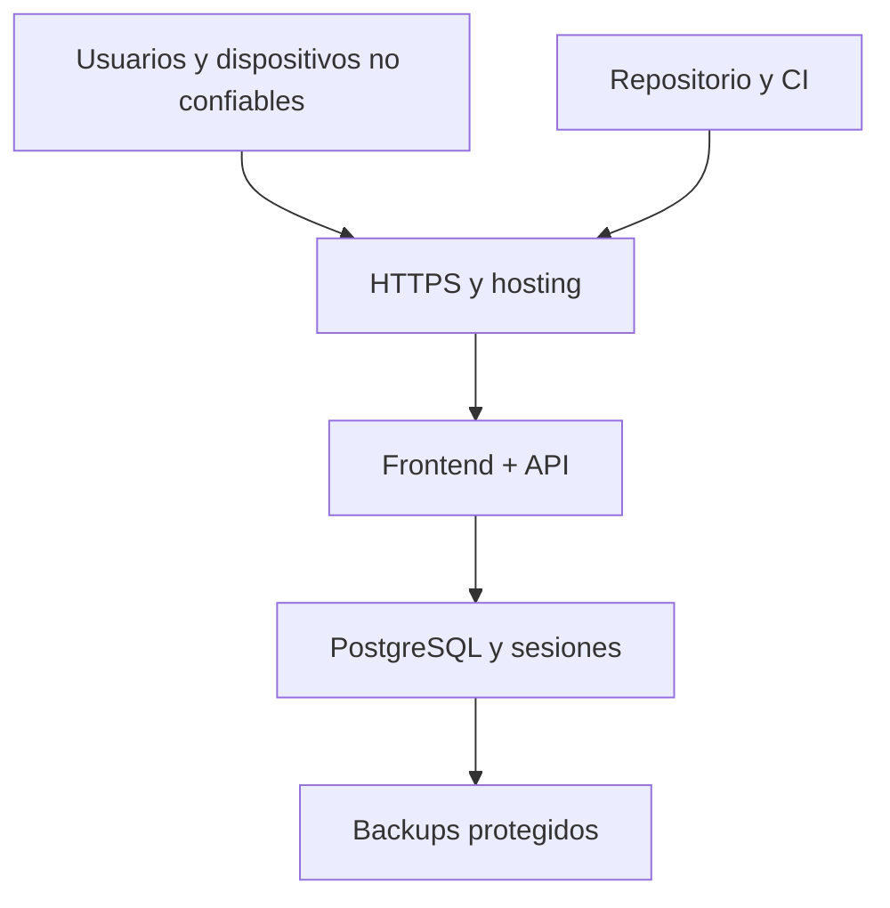

# 09 — Modelo de amenazas

**Proyecto:** Sistema POS e inventario para minimarket familiar

**Estado:** Aprobado - Entrega 2

**Versión:** 0.1

**Fecha:** 2026-07-31

## 1. Objetivo y método

Identificar cómo podrían alterarse ventas, caja, inventario, credenciales o disponibilidad, y asignar controles proporcionales antes de implementar. Se utiliza STRIDE como guía y una evaluación cualitativa de probabilidad e impacto.

Este documento no certifica cumplimiento ni reemplaza pruebas de seguridad. Debe revisarse cuando cambien arquitectura, despliegue, autenticación, lector o integraciones.

## 2. Alcance

Incluye:

- Navegador del POS y de administración.
- Interfaz móvil del lector.
- Frontend estático.
- API Spring Boot.
- PostgreSQL y sesiones.
- CI/CD, secretos, logs y backups.

Excluye por ahora bancos, adquirentes, SII, aplicación nativa y sistemas de proveedores.

## 3. Activos

| Activo | Sensibilidad | Daño principal si se compromete |
|---|---:|---|
| Credenciales y sesiones | Crítica | Suplantación y operaciones no autorizadas |
| Ventas y anulaciones | Crítica | Pérdida de dinero e historial falso |
| Caja y movimientos | Crítica | Diferencias físicas y fraude difícil de rastrear |
| Inventario y movimientos | Alta | Sobreventa, pérdidas y reportes incorrectos |
| Roles y usuarios | Crítica | Escalada de privilegios |
| Tokens del lector | Alta, efímera | Escaneos falsos o enviados a otra caja |
| Base de datos | Crítica | Corrupción o exposición total |
| Backups | Crítica | Exfiltración o incapacidad de recuperación |
| Logs de auditoría | Alta | Ocultamiento de acciones o exposición de secretos |
| Repositorio y pipeline | Crítica | Código o despliegue comprometido |

## 4. Actores de amenaza

- Atacante externo sin credenciales.
- Usuario interno curioso, negligente o malicioso.
- Malware o extensión comprometida en computador o teléfono.
- Persona que fotografía o reutiliza un QR.
- Error humano durante configuración, migración o cierre.
- Dependencia, acción de CI o paquete comprometido.
- Persona con acceso indebido a base, backup o secretos cloud.

## 5. Límites de confianza y flujo

Límites:

1. Entrada desde navegador a frontend/API.
2. Cambio desde usuario anónimo a sesión autenticada.
3. Cambio desde vendedor a operación administrativa.
4. Comunicación entre API y base.
5. Token QR antes y después de ser consumido.
6. Código fuente y dependencias hacia artefactos desplegados.
7. Datos productivos hacia backups y restauraciones.

## 6. Escala de riesgo

- **Crítico:** puede producir corrupción de ventas/caja, control administrativo o pérdida amplia de datos.
- **Alto:** causa fraude, indisponibilidad relevante o exposición sensible.
- **Medio:** impacto limitado, recuperable o que requiere condiciones adicionales.
- **Bajo:** efecto menor y fácilmente detectable.

El riesgo residual supone que los controles indicados funcionan y han sido probados.

## 7. Amenazas y tratamiento

| ID | STRIDE | Amenaza | Riesgo inicial | Controles principales | Residual esperado |
|---|---|---|---:|---|---:|
| THR-AUTH-001 | S | Fuerza bruta o credenciales robadas | Alto | Argon2id, respuestas genéricas, rate limit, auditoría, desactivación | Medio |
| THR-SESS-001 | S/E | Robo o fijación de sesión | Alto | Cookie opaca, `HttpOnly`, `Secure`, rotación, expiración e invalidación | Bajo |
| THR-CSRF-001 | T/E | Sitio externo provoca una operación autenticada | Alto | Token CSRF, `SameSite`, verificación de origen | Bajo |
| THR-AUTHZ-001 | E | Vendedor invoca ajuste, usuario o anulación | Crítico | Denegar por defecto, autorización en endpoint y servicio, pruebas de matriz | Bajo |
| THR-IDOR-001 | E/I | Acceso a recursos cambiando un identificador | Alto | Autorización por operación, DTO limitados y consultas con contexto | Bajo |
| THR-SALE-001 | T | Cliente altera precio, costo, subtotal o total | Crítico | Backend vuelve a resolver y calcular; DTO no acepta costo | Bajo |
| THR-SALE-002 | T | Doble clic o reintento crea dos ventas | Crítico | Clave de idempotencia, hash de solicitud y unicidad en DB | Bajo |
| THR-INV-001 | T | Dos ventas consumen la última unidad | Crítico | Bloqueos ordenados, transacción y `CHECK` no negativo | Bajo |
| THR-TX-001 | T | Falla parcial deja venta sin caja o inventario | Crítico | Única transacción y pruebas de rollback | Bajo |
| THR-CASH-001 | T/R | Se reescribe una caja cerrada o se oculta diferencia | Crítico | Inmutabilidad, compensaciones, permisos y auditoría | Bajo |
| THR-VOID-001 | E/R | Anulación no autorizada o duplicada | Alto | Admin, motivo, bloqueo de venta, unicidad y registro | Bajo |
| THR-SCAN-001 | S | QR robado o token reutilizado | Alto | Alta entropía, hash, TTL corto, un solo uso y revocación | Bajo |
| THR-SCAN-002 | T | Código enviado a otra sesión POS | Alto | Alcance de sesión, autorización del stream y correlación | Bajo |
| THR-SCAN-003 | D/T | Repetición o inundación de eventos | Medio | `eventId` único, rate limit, límites de longitud y expiración | Bajo |
| THR-INJ-001 | T/I | Inyección SQL o manipulación de consultas | Alto | JPA parametrizado, sin SQL dinámico con entrada y validación | Bajo |
| THR-XSS-001 | S/I | Nombre o error malicioso ejecuta script | Alto | Escape React, sin HTML inseguro, CSP y validación | Bajo |
| THR-CORS-001 | I/E | Origen no autorizado usa sesión o API | Alto | Mismo origen preferido; allowlist exacta y credenciales restringidas | Bajo |
| THR-LOG-001 | I/R | Logs filtran tokens o no permiten atribución | Alto | Redacción, correlation ID, acceso limitado y auditoría estructurada | Bajo |
| THR-SECRET-001 | I/E | Secreto comprometido en repositorio o CI | Crítico | Secretos externos, escaneo, mínimo privilegio y rotación | Medio |
| THR-SUPPLY-001 | T/E | Dependencia o pipeline comprometido | Alto | Versiones fijadas, revisión, escaneo y acciones de CI inmovilizadas | Medio |
| THR-DB-001 | T/I | Cuenta runtime modifica esquema o extrae datos | Crítico | Rol sin DDL, red restringida, TLS y credenciales separadas | Bajo |
| THR-BACKUP-001 | I | Backup expuesto | Alto | Cifrado, acceso limitado, retención y pruebas aisladas | Bajo |
| THR-RECOVERY-001 | D | Backups no restaurables | Crítico | Restauración ensayada y evidencia | Bajo |
| THR-AVAIL-001 | D | Caída, suspensión o cuota agotada del plan gratuito detiene ventas | Alto | Salud, monitoreo de cuotas, backup y procedimiento manual del negocio | Alto aceptado |
| THR-COST-001 | T | Un recurso gratuito escala, supera cuota o genera cobros accidentales | Medio | Prohibir autoescalado pagado, revisar facturación, límites y aprobación previa | Bajo |

## 8. Casos de abuso prioritarios

### ABUSE-001 — Modificar el precio desde DevTools

El usuario cambia el total o precio enviado. El backend ignora esos valores, obtiene el producto vigente y recalcula todo. La prueba debe modificar explícitamente el payload.

### ABUSE-002 — Confirmar dos veces

La interfaz envía dos solicitudes simultáneas con la misma intención. La base conserva una venta y la segunda respuesta devuelve el resultado existente.

### ABUSE-003 — Vender simultáneamente la última unidad

Dos solicitudes diferentes compiten por una unidad. Una confirma; la otra recibe conflicto de stock. El saldo y los movimientos quedan consistentes.

### ABUSE-004 — Anular como vendedor

Un vendedor llama directamente al endpoint administrativo. La solicitud se rechaza antes de ejecutar cambios y se registra el intento relevante.

### ABUSE-005 — Reutilizar un QR fotografiado

El token ya consumido o expirado se rechaza. La sesión lectora creada queda vinculada solo al POS original y puede revocarse.

### ABUSE-006 — Usar una clave idempotente con otro carrito

Una clave ya asociada a otro hash no devuelve ni crea una venta diferente; responde conflicto y registra el evento.

### ABUSE-007 — Devolver efectivo contra una caja cerrada

La aplicación rechaza modificar la caja histórica. Solo permite la devolución si existe una caja abierta, donde registra la salida.

## 9. Riesgos aceptados o diferidos

### Operación online

El MVP no funcionará sin conectividad. El negocio deberá definir un procedimiento manual de contingencia antes de producción. No se implementará sincronización offline ni carga masiva retroactiva sin un análisis separado.

### Infraestructura gratuita

Los planes gratuitos pueden suspender servicios, reducir recursos, cambiar cuotas, eliminar datos inactivos o no entregar SLA. Durante la etapa actual este riesgo se acepta para desarrollo, demostración y staging. Un entorno gratuito no se considerará producción real hasta demostrar persistencia, backup, restauración y disponibilidad aceptables. No se habilitarán recursos pagados automáticamente como mitigación.

### MFA

No se exige MFA inicialmente debido al tamaño y contexto del negocio. Se mantienen contraseñas robustas, rate limiting, sesiones seguras y auditoría. Se reevaluará si el sistema queda expuesto ampliamente o maneja más usuarios.

### Integraciones de pago

El sistema registra tarjeta y transferencia declaradas por el vendedor. No puede confirmar que el dinero llegó. Ese riesgo operacional no se resuelve técnicamente hasta integrar un proveedor externo.

## 10. Validación requerida

Antes de producción se comprobará al menos:

- Matriz completa de autorización.
- CSRF y CORS.
- Doble confirmación e idempotencia con contenido distinto.
- Concurrencia por última unidad.
- Rollback ante fallas intermedias.
- Anulación duplicada y devolución sobre caja incorrecta.
- QR expirado, consumido, revocado y de otra sesión.
- Inyección, XSS básico y manejo seguro de errores.
- Ausencia de secretos y tokens en logs.
- Restauración de backup.

## 11. Revisión

El modelo se revisará:

- Al incorporar el lector.
- Antes del primer staging público.
- Antes de producción.
- Al agregar una integración externa.
- Después de un incidente o cambio importante de autenticación.
